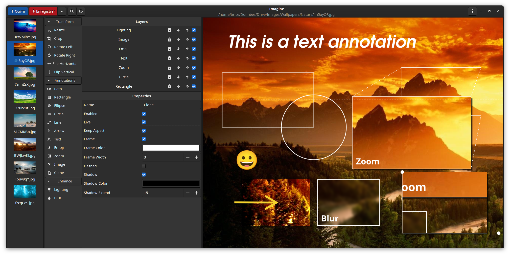

# Imagine

## Introduction

Imagine is a simple images annotation tool, written in Python 3.

It offers you a fast way to add annotations such as basic shapes, text, emojis to your image.
There are also some more advanced features like layers management, real time zooming of parts of the image, cloning, and so on.
Some basic image corrections are also available: brightness, contrast, sharpness, colors, blur, etc.

More features will be added over time.

Only JPEG and PNG are supported for the moment (which should be more than enough for the majority of us).

**Please make a backup of your images before editing them as the application is still in its early development days and might presents some bugs!**

### Accelerator

I added an "accelerator" in the application, some kind of a fast keyboard shortcuts helper to help you annotate your pictures faster.

Note that the accelerator has a timeout: as soon as you start a command you have 1 second to finish it or it will be reset.

Eg: "s,a" means you have to hit the "s" key and then the "a" key within the second. 

I will offer a way to customize the delay later. As well as the mapping itself.

| Shortcut  | Usage                                  |
|-----------|----------------------------------------|
| Tab       | Switch (cycle) in the documents        |
| Page Up   | Switch to the previous document        |
| Page Down | Switch to the next document            |
| Delete    | Delete current layer                   |
| Backspace | Delete current layer                   |
| Escape    | Cancel current layer modifications     |
| Ctrl+z    | Undo your last modification            |
| Ctrl+w    | Close the current image                |
| r         | Resize the image                       |
| Ctrl+s    | Save the image                         |
| s,a       | Save all the images                    |
| s,s       | Save current image as                  |
| c         | Crop                                   |
| r,l       | Rotate left                            |
| r,r       | Rotate right                           |
| f,h       | Flip horizontal                        |
| f,v       | Flip vertical                          |
| a,p       | Add Path annotation                    |
| a,r       | Add Rectangle annotation               |
| a,l       | Add Line annotation                    |
| a,a       | Add Arrow annotation                   |
| a,e       | Add Ellipse annotation                 |
| a,c       | Add Circle annotation                  |
| a,d       | Clone/duplicate part of the image      |
| a,t       | Add Text annotation                    |
| a,j       | Add Emoji annotation                   |
| a,z       | Zoom part of the image                 |
| a,i       | Add Image annotation                   |
| e,l       | Enhance / Lightning                    |
| e,b       | Enhance / Blur                         |
| z,z       | Zoom (best fit)                        |
| z,a       | Zoom (100%)                            |
| Up        | Move the layer up in the stack         |
| Down      | Move the layer down in the stack       |

### History management (undo)

I also added an history manager (only undos supported for now, not redos).

You can cancel the last action with Ctrl+z. Or use the history manager from the toolbar.

## Installation

To install Imagine on your system.

~~~
git glone http://gitlab.boite.io/brice/imagine.git
meson setup build
cd build
meson compile
meson install
~~~

Building as a Flatpak package hasn't been setup yep. It will be in a near future.

I will also add an icon and a better Linux desktop integration pretty soon.

## License

[Imagine is under GNU GPLv3 license](http://gitlab.boite.io/brice/imagine/-/blob/main/COPYING).

## Final words

This is my first Linux app development, and my first Python-based app for that matter; so if you find bugs or got ideas, feel free to share them with me or make push requests as soon as you have implemented them :P
